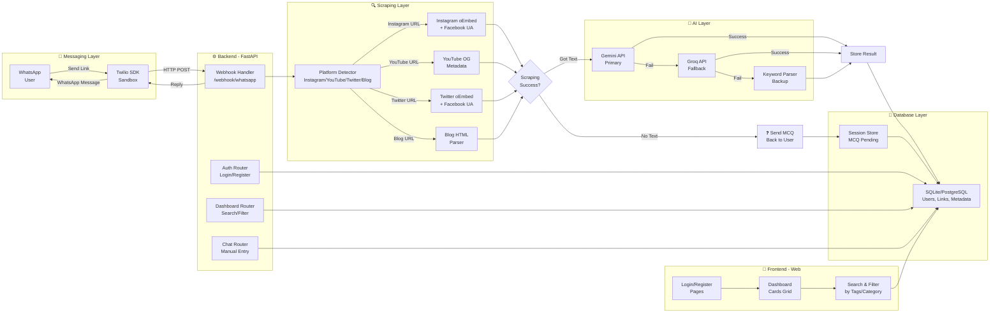

# Social Saver Bot - Architecture Diagram

This diagram shows the system architecture with all components and how they interact.

## Architecture Layers

### **📱 Messaging Layer**
- WhatsApp integration via Twilio Sandbox
- Webhook endpoint receives and sends messages

### **⚙️ Backend - FastAPI**
- **Webhook Handler**: Processes incoming messages from Twilio
- **Auth Router**: User login/registration with session cookies
- **Dashboard Router**: Search and filter saved links
- **Chat Router**: Manual link submission

### **🔍 Scraping Layer**
- **Platform Detection**: Identifies content source
- **Instagram**: Uses oEmbed API + Facebook's crawler UA
- **YouTube**: Extracts OG metadata (title, description, thumbnail)
- **Twitter/X**: Uses oEmbed API + Facebook crawler UA
- **Blog**: HTML parsing with BeautifulSoup

### **🤖 AI Layer**
- **Primary**: Google Gemini API (gemini-2.0-flash)
- **Secondary**: Groq API with Llama model
- **Tertiary**: Keyword-based fallback parser

### **💾 Database Layer**
- **SQLite** (local development)
- **PostgreSQL** (production via Render)
- Stores: Users, Links, Metadata, Tags
- **Session Store**: In-memory MCQ pending links

### **🎨 Frontend - Web**
- **Login/Register**: User authentication
- **Dashboard**: Card-based layout with filters
- **Search**: Full-text search with tag matching and category filters
