# Social Saver Bot - System Flow

This diagram shows the complete user journey from sending a WhatsApp message to viewing saved content on the dashboard.

```mermaid
graph TD
    A["📱 User Sends Link<br/>via WhatsApp"] --> B["🔗 Twilio Webhook<br/>Receives Message"]
    B --> C["🔍 Extract URL<br/>from Message"]
    C --> D{"✅ Valid<br/>URL?"}
    
    D -->|No| E["❌ Send Error<br/>Reply"]
    E --> A
    
    D -->|Yes| F{"🎯 Detect<br/>Platform"}
    
    F -->|Instagram| G["📸 Scrape Instagram<br/>oEmbed API"]
    F -->|YouTube| H["🎬 Scrape YouTube<br/>OG Metadata"]
    F -->|Twitter/X| I["🐦 Scrape Twitter<br/>oEmbed API"]
    F -->|Blog| J["📄 Scrape Blog<br/>og:title & og:description"]
    
    G --> K{"📝 Got<br/>Text?"}
    H --> K
    I --> K
    J --> K
    
    K -->|Yes| L["🤖 AI Categorization"]
    K -->|No| M["❓ Send MCQ<br/>Multiple Choice"]
    M --> N["👤 User Selects<br/>Category"]
    N --> O["💾 Save to Database"]
    
    L --> P{"AI<br/>Success?"}
    P -->|Gemini| Q["✅ Got Category<br/>& Summary"]
    P -->|Gemini Fails| R["🔄 Try Groq API<br/>Llama Model"]
    R --> S{"Groq<br/>Success?"}
    S -->|Yes| Q
    S -->|No| T["🔑 Keyword<br/>Fallback"]
    T --> Q
    
    Q --> O
    O --> U["✅ Send WhatsApp<br/>Confirmation"]
    U --> V["📊 Display on<br/>Dashboard"]
    V --> W["🔎 User Searches<br/>& Filters"]
    W --> X["✨ View Saved<br/>Content"]
```

## Flow Explanation

1. **User Input** - User sends a link via WhatsApp
2. **URL Extraction** - Bot validates the URL format
3. **Platform Detection** - Identifies Instagram, YouTube, Twitter, or Blog
4. **Content Scraping** - Extracts metadata using appropriate method for each platform
5. **AI Processing** - Categorizes content with fallback mechanisms:
   - Primary: Google Gemini API
   - Secondary: Groq API (Llama)
   - Tertiary: Keyword-based scoring
6. **MCQ Fallback** - If scraping yields no text, asks user via WhatsApp
7. **Database Storage** - Saves link with category, summary, and tags
8. **Confirmation** - Sends success message back to WhatsApp
9. **Dashboard Display** - Content appears in user's web dashboard
10. **Search & Filter** - User can search by tags, category, or text
